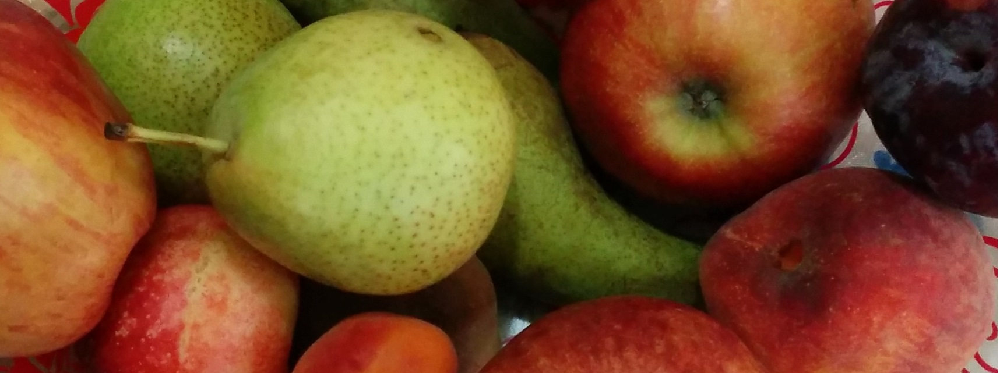

# Fruits-360 dataset

## Download

The dataset consists of multiple repositories:

- [Fruits-360 100x100](https://github.com/fruits-360/fruits-360-100x100) (Images scaled to 100x100 pixels. Currently contains 171001 pictures of 245 fruits, vegetables, nuts and seeds.)

- [Fruits-360 original-size](https://github.com/fruits-360/fruits-360-original-size) (Original (captured) size images. Currently contains 90607 pictures of 130 fruits, vegetables, nuts and seeds.)

- [Fruits-360 3-body-problem](https://github.com/fruits-360/fruits-360-3-body-problem) (A 3-class classification problem, where the Training and Test folders contain different (varieties of) the 3 fruits and vegetables (Apples, Cherries and Tomatoes). Currently contains 47033 pictures of Apples, Cherries and Tomatoes.)

- [Fruits-360 meta](https://github.com/fruits-360/fruits-360-meta) (Attributes. Currently contains full data for 26 objects and partial data ((type, defects, maturity) for 245 objects.)

- [Fruits-360 multi](https://github.com/fruits-360/fruits-360-multi) (Multiple objects in the same picture. Currently contains 150 images.)

- [Fruits-360 papers](https://github.com/fruits-360/fruits-360-papers) (Papers using Fruits-360 dataset.)

## Author

[Mihai Oltean](https://mihaioltean.github.io)

email: mihai.oltean@gmail.com

## How to cite

Mihai Oltean, __Fruits-360 dataset__, 2017-.

## History

- __2016 (begining of)__. I met with a private company that needed a robot to handle the goods from their food stores. My solution was to use [Jenny 5 robot](https://jenny5-robot.github.io/) for this purpose. Even if *Jenny 5 robot* has three Logitech C910 cameras, we had no serious algorithm capable of recognizing food. So, the first step was to build a dataset with many images of foods that could be fed into a neural network as training data ...

- __2016 (at the end)__. I started collecting fruits (either from my own garden or purchased from local stores). I stuck them into a low-rpm motor and filmed them. Initially, the films were made inside my room, which has blue-painted walls, whose reflection is visible in many images from that time.

- __2017 (begining of)__. A student of mine wrote an example of using TensorFlow for the Fruits-360 dataset.

- __2017 (summer of)__. The student presented his work at a local symposium for students.

- __2017 (end of)__. A more complete paper with the dataset and numerical experiments has been accepted and publised by *Acta Univ. Sapientiae*. The paper has been updated several times after publication to include results for newer dataset versions.

- __2017 (end of)__. The dataset has been uploaded to Kaggle: [https://www.kaggle.com/datasets/moltean/fruits](https://www.kaggle.com/datasets/moltean/fruits).

- __2021 (begining of)__. Original (captured) size images will be published from now on.

- __2021 (begining of)__. The metadata (properties) of fruits will be included in the dataset.

- __2024.02.17__. The dataset has been moved to a new location on GitHub: [https://gihub.com/fruits-360](https://gihub.com/fruits-360). The organization contains multiple repositories.

- __2025.03.23__. New repository with papers using Fruits-360 dataset:  [https://github.com/fruits-360/fruits-360-papers](https://github.com/fruits-360/fruits-360-papers)

- __2025.04.01__. New dataset: Fruits-360, 3-body problem:  [https://github.com/fruits-360/fruits-360-3-body-problem](https://github.com/fruits-360/fruits-360-3-body-problem)

## Papers (using Fruits-360 dataset)

- Mihai Oltean, [Fruits-360 dataset: new research directions](https://www.researchgate.net/publication/354535752_Fruits_360_dataset_new_research_directions), Technical report, 2021.

- Horea Muresan, Mihai Oltean, [Fruit recognition from images using deep learning](https://www.researchgate.net/publication/321475443_Fruit_recognition_from_images_using_deep_learning), Acta Univ. Sapientiae, Informatica, Vol. 10, Issue 1, pp. 26-42, 2018.

More papers using Fruits-360 dataset are here: [https://github.com/fruits-360/fruits-360-papers](https://github.com/fruits-360/fruits-360-papers)

## Provenance

All fruits, vegetables, nuts, seeds etc, are from:

- my own garden (located in Cugir, Romania) or
- purchased, by me, from local stores.

I have recorded all the movies containing the fruits, vegetables, etc in the Fruits-360 dataset.

I have extracted (from movies) all pictures in the Fruits-360 dataset.

I have NOT taken pictures from other sources.

I have NOT generated artificial pictures of fruits, vegetables, nuts or seeds.

## License

CC BY-SA 4.0

Copyright (c) 2017-, [Mihai Oltean](https://mihaioltean.github.io)

You are free to:

*Share* — copy and redistribute the material in any medium or format for any purpose, even commercially.

*Adapt* — remix, transform, and build upon the material for any purpose, even commercially.

Under the following terms:

*Attribution* — You must give appropriate credit , provide a link to the license, and indicate if changes were made . You may do so in any reasonable manner, but not in any way that suggests the licensor endorses you or your use.

*ShareAlike* — If you remix, transform, or build upon the material, you must distribute your contributions under the same license as the original.